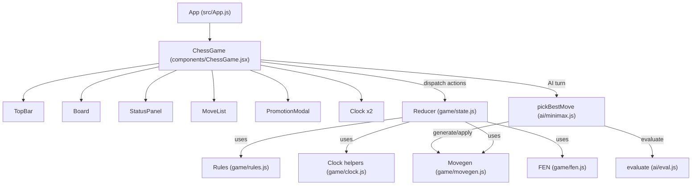

# Architecture

## Overview

The app follows a clean separation between UI components, game logic, AI, and configuration:

- UI: React function components in src/components render the board, controls, side panels, and modals.
- Game core: src/game contains pure modules for chess rules, move generation, FEN conversions, reducer-driven state management, and clock logic.
- AI: src/ai includes a basic evaluator and a depth-limited minimax with alpha–beta pruning.
- Config: src/config/featureFlags.js parses feature flags from environment variables to toggle optional behavior.

This separation keeps most game logic pure and testable, and confines React hooks and side effects to the top-level ChessGame component.

## Key modules and responsibilities

### Components

- ChessGame.jsx
  - Orchestrates the application: initializes feature flags and reducer state, wires handlers, runs the animation-frame clock loop, and schedules AI moves via setTimeout.
  - Manages promotion modal interactions and passes props to Board, TopBar, StatusPanel, MoveList, and Clock components.

- Board.jsx and Square.jsx
  - Board renders the 8×8 grid with 80px squares, tracks selection and legal move highlights, and displays SVG piece assets via require.context.
  - Square renders an accessible button that can reflect selection, highlight, and last-move states.

- TopBar.jsx
  - Provides “New game,” mode selection (PvP / Vs AI), piece theme selector scaffold, clock preset selection, increment mode, Undo, and AI depth controls.

- StatusPanel.jsx and MoveList.jsx
  - StatusPanel shows current status strings, mode, winner (including timeout), and active time control.
  - MoveList renders a simple SAN-like record (coordinates from-to with capture and promotion markers, castling via O-O / O-O-O).

- Clock.jsx
  - Displays each player’s remaining time, a running/highlight state, flags on timeout, and increment/delay text.
  - Uses formatClock from src/game/clock.js for M:SS or H:MM:SS display.

### Game core

- fen.js
  - parseFEN parses a FEN into a position with board, sideToMove, castling rights, epSquare, and counters.
  - toFEN serializes the current position back into FEN.

- rules.js
  - pieceColor, opposite, isKing, isPawn helpers.
  - isSquareAttacked and inCheck are used for legal move validation and status computation.

- movegen.js
  - generatePseudoLegalMoves emits non-king-safety-filtered moves (including ep and castling pre-checks).
  - generateLegalMoves filters pseudo-legal moves by ensuring the mover’s king isn’t left in check.
  - applyMove returns a new position after applying a move, updating castling rights, epSquare, halfmove/fullmove counters, and rook shifts during castling.

- clock.js
  - applyPostMoveTimeAdjustment implements Fischer increment and Bronstein delay post-move adjustments as pure math.
  - formatClock formats milliseconds for display.

- state.js
  - createInitialState builds the initial game state, including default time control (5+0), AI defaults, and status.
  - chessReducer is the single point for state transitions: SET_MODE, NEW_GAME, UNDO, SELECT_SQUARE, MAKE_MOVE, CLOCK_* actions, increment mode/preset changes, PROMOTE_LAST, etc.
  - CLOCK_PRESETS enumerates a few sensible defaults.
  - isAiTurn and humanColor provide small helpers for turn logic in AI mode.

### AI

- eval.js
  - Simple material values plus small piece-square tables for pawns and knights to avoid trivial randomness.

- minimax.js
  - pickBestMove runs a depth-limited alpha–beta minimax, with optional random tie-break among near-equal root moves to add variety.

## Data flow and state management

- The ChessGame component holds the reducer [state, dispatch], initialized with createInitialState(getFeatureFlags()).
- User actions (clicks on squares, control changes) dispatch actions to the reducer. The reducer:
  - Computes legal moves on selection.
  - Applies moves via applyMove and updates status via computeStatus (in state.js).
  - Integrates clocks: on each move, adjusts mover’s time (Fischer/Bronstein) and starts the next side’s timer.
- A requestAnimationFrame loop issues CLOCK_TICK deltas while the game is in progress to decrement the active side’s remaining time.
- When in AI mode and it is AI’s turn, ChessGame pauses the clock and schedules a small setTimeout that calls pickBestMove and dispatches MAKE_MOVE; after AI moves, the clock is resumed.

## Feature flags

Feature flags are parsed in src/config/featureFlags.js:
- REACT_APP_FEATURE_FLAGS: a comma/space-separated list; if provided, only the listed features are enabled.
- REACT_APP_EXPERIMENTS_ENABLED: when "true", experimental features can be turned on (currently only darkMode).

Defaults enable ai, showLegalMoves, undo, promotionChoice, coordinates, and aiRandomTieBreak.

## Architecture diagram

## Notes on AI mode

- AI side is black by default; human plays white.
- The AI does not consume clock time by default; the human clock is paused while AI is thinking, then the clock resumes for the human after the AI move.
- Depth defaults to 2 and can be adjusted to 1–3 in the TopBar.

## Limitations and trade-offs

- The AI is intentionally basic and optimized for simplicity rather than strength.
- Some draw rules (e.g., threefold repetition, 50-move rule) are not fully implemented.
- The piece theme system is scaffolded; only a single default asset set is provided.

## References (source index)

- Components: src/components/*.jsx
- Game core: src/game/*.js
- AI: src/ai/*.js
- Config: src/config/featureFlags.js
- Utilities: src/utils/*.js
- Entry: src/App.js, src/index.js
